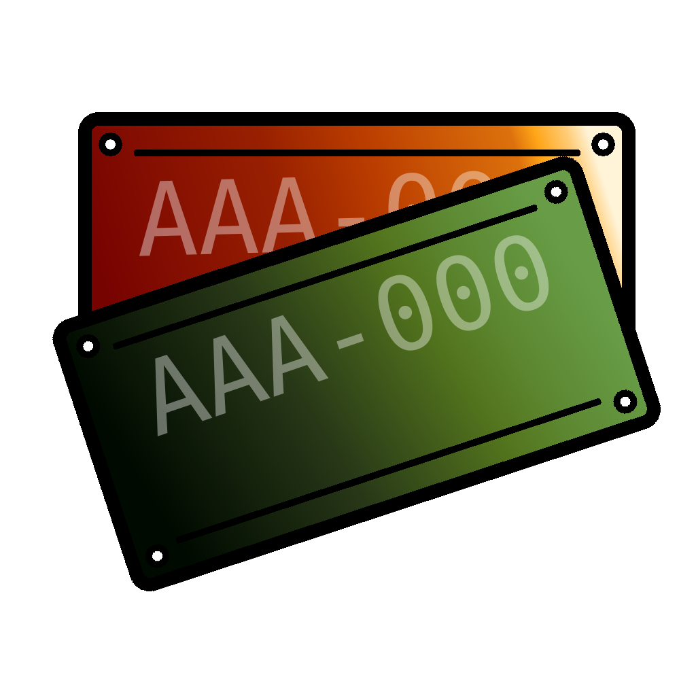

#  travelplates
An app to keep track of state license plates while on road trips.

**Note: This has been a practice project for me to learn Dart and Flutter. I've asked a lot of questions of Gemini while building it.

## Layout
### Screens
- Trip list
- Trip detail
- License plate list
- State detail
- Add trip
### Models
- License plate models
- Plate entry
- Trip
### Data
- Initial States
- State Centroids
### Services
- Trip Storage

## Dependencies
```
uuid: ^4.4.0
path_provider: ^2.1.3
intl: ^0.18.1
geolocator: ^12.0.0
flutter_map: ^6.1.0
```